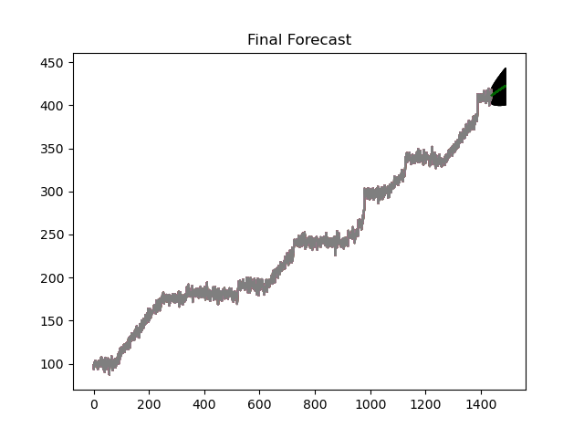

# EE-629-Project
Machine lifetime prediction using Pi Camera and Google cloud.

Technologies Used :

* Internet of Things.

* Image processing.

  

  

  
* Data Analysis.
* Time-Series Analysis.

 

* Google API.
Genreate Oauth2.0 Client ID for Web Application.

* Augmented Reality.

