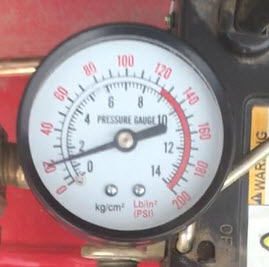

# EE-629-Project
Machine lifetime prediction using Pi Camera and Google cloud.

Technologies Used :

* Internet of Things.

* Image processing.

  

  

  
* Regression Prediction.

* Time-Series Analysis.

 

* Google API.
Genreate Oauth2.0 Client ID for Web Application.

* Augmented Reality.

QR Code Assigned to Every Machine 

Augmented Reality Application output.

