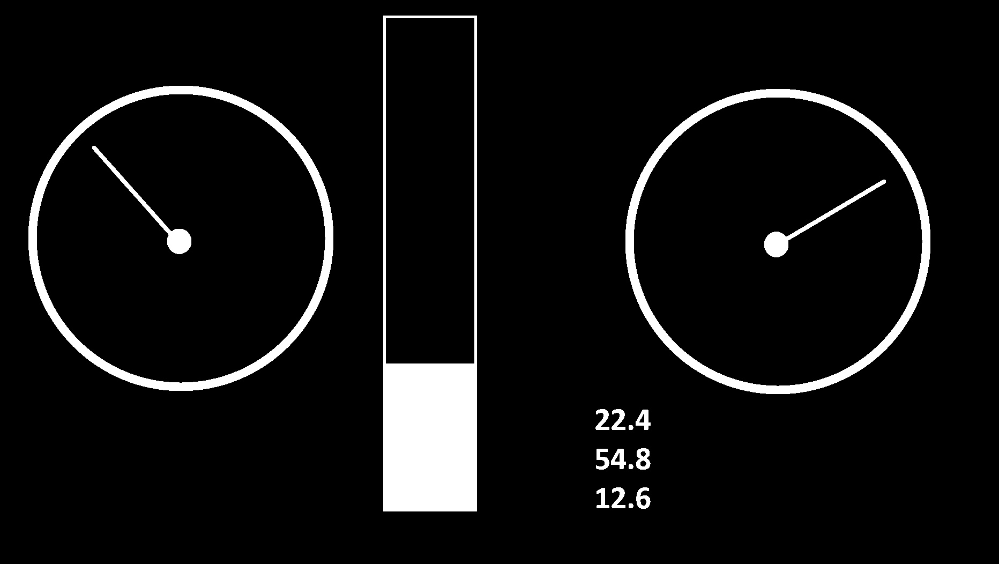
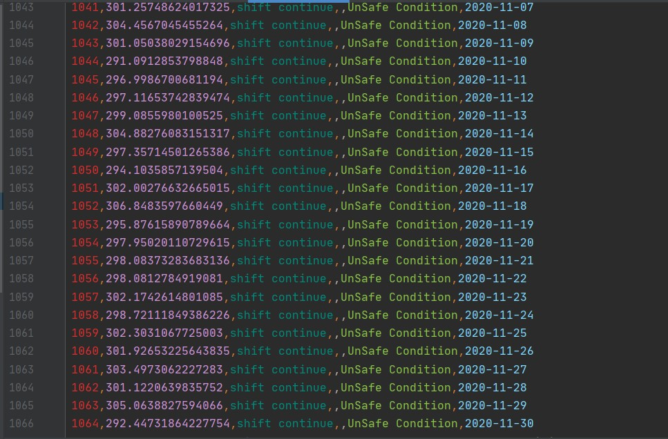

# EE-629-Project
Machine lifetime prediction using Pi Camera and Google cloud.

Code Files:
* upload_live_param1.py = Machine Learning and Cloud uploading.
* Image Processing/arasm_live.py = Capturing image, Processing and creating Dataset based on Image processing output.

Technologies Used:

* Internet of Things.
  - Camera module with help of Image Processing acts as Sensors.
  - Machine Learning module Processes the data.
  - Results obtained from Machine Learning are then stored in Google Cloud using Googel API.
  - Augmented Reality based application allows users to access the Data on their personal Android or IOS devices.

Capture Images every 5 seconds using Camera module.

* Image processing.

Processing Multiple Analog Output devices such as Gauge, Thermometer, Ammeter/Voltmeter digits, etc.
Libraries Used: 
  - OpenCV 
  - Tesseract
  - PIL.

  

 

  

* CSV File generation

Generate CSV File using Pandas library.

* Regression Prediction.
Calculate Prognosis and Diagnosis Based on collected data using ARIMA.

* Time-Series Analysis.
Generate Graph based on Predictions.

* Google API Configuration.
Genreate Oauth2.0 Client ID for Web Application.

https://console.developers.google.com/apis/dashboard 

- Steps:
  - Create a Project
  - Click on 'Enable API's and Services'
  - Search for Google Drive API and enable API
  - Click on 'Credentials'
  - Create 'OAuth 2.0 Client IDs'
  - Download JSON file after configuration
  

 
(Download JSON file and create Pickle file containing Token which bypasses authentication for frequent use.)

* Augmented Reality.
Create QR code for Collecting Data from cloud.

https://developer.vuforia.com/vui/develop/licenses

- Steps:
  - Click on 'Target Manager'.
  - Create Dataset and Click on 'Add Target'.
  - Save information and Download image.

Unity, Vuforia Application

Install app in your android/IOS device.

Hover mobile camera over QR code and you can supervise and watch real-time graph generation and information regarding Machine state and Lifetime Prediction.

